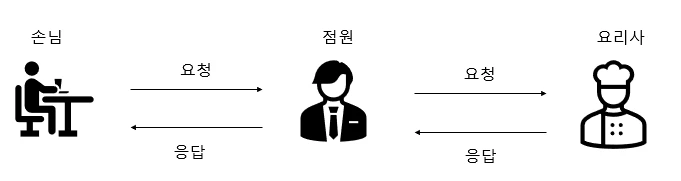
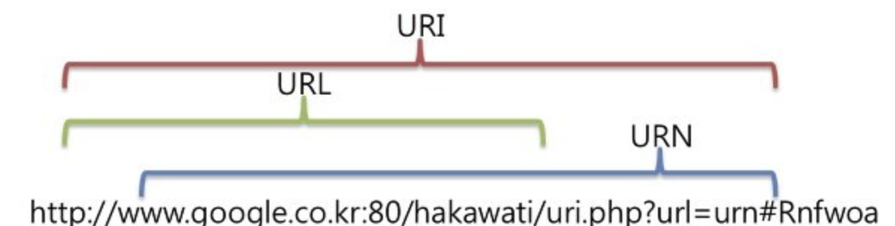
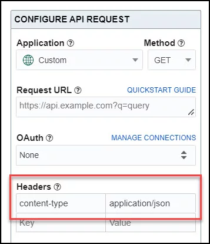

week2  

## API❓

>📝 한줄 정리 : Application Programming Interface   

- Application ---> 고유한 기능을 가진 모든 소프트웨어  
- Interface   ---> 두 애플리케이션 간의 서비스 계약   
- 계약 : 요청과 응답을 사용하여 두 애플리케이션이 서로 통신하는 방법 정의  
- API 문서 : 개발자가 이러한 요청과 응답을 구성하는 방법에 대한 정보  
- 클라이언트 : 요청을 보내는 애플리케이션   
- 서버 : 응답을 보내는 애플리케이션  
- private / public / partner API  
- API 를 사용면 서로 원활히 통신하고 잘 연동되도록 해줌. 많은 부분을 통합하고 표준화함으로써 간소화되고 빠른 프로세스 처리가 가능.  

## REST API❓  
> API가 생성된 시기와 이유에 따라서 분류(SOAP, RPC, Websocket, REST)  
#### 1. REST의 의미  
  - Representational State Transfer  
  - REST를 기반으로 서비스 API를 구현한 것   
  - ex) 네이버에서 제공하는 Open API를 이용 -> 특정 기술(네이버 지도)을 사용하고 싶다면,  URI 형식으로 HTTP 메서드를 요청해 자원을 조회, 생성, 수정, 삭제 = REST API
#### 2. REST의 구성 요소와 특징    
- 자원(resource) : 모든 자원에는 고유한 id가 존재하고, 이 자원은 서버에 존재. rest는 자원에 접근할 때 URI를 이용. 여기서 URI는 자원의 위치를 나타내는 일종의 식별자  
- 메서드(Method) : rest는 기본적으로http 메서드를 사용. GET(해당 리소스 조회), POST(해당 리소스 생성),PUT(해당 리소스 수정),DELETE(해당 리소스 삭제) 등이 존재  
- 메시지(Message) : 메시지는 HTTP hearder, body, 응답 상태 코드 등으로 구성
- 계층화 : rest 서버는 다중 계층으로 구성   
- 무상태(Stateless) : 서버가 클라이언트 데이터를 저장 x  
- 오늘날 가장 많이 사용되고 유연한 API  
- 자체 표현 구조(self-descriptiveness)로 구성되어 rest api만으로 요청을 이해
#### 3. REST의 장단점   
- 통합 : 새로운 애플리케이션을 기존 소프트웨어 시스템과 통합 -> 기존 코드 활용 가능 -> 개발 속도 빨라짐  
- 확장 : 기업이 다양한 플랫폼에서 고객의 요구 사항을 충족할 수 있는 기회 제공  
- 유지 관리의 용이성 : 두 시스템 간의 게이트웨이 역할 -> API가 영향 받지 않도록 각 시스템이 내부적으로 변경  
- HTTP 메소드의 한계 : 간단한 수준의 메소드만 지원 가능  
- RDBMS : RESTful한 테이블 구조가 필요함 -> NoSQL 사용이 좋음   

#### 4. 그 외  
- SOAP API : 단순 객체 접근 프로토콜, xml 사용하여 메시지 교환  
- RPC API : 원격 프로시저 호출, 클라이언트가 서버에서 함수나 프로시저 완료 -> 서버가 클라이언트에 출력 전송  
- Websocket API : JSON 객체 사용, 양방향 통신 지원, 서버가 연결된 클라이언트에 콜백 메시지 전송 가능  

 
## API에서 사용하는 용어  

1. url / baseurl /uri    
- url : uniform resource locator, 인터넷에서 웹 페이지, 이미지, 비디오 등 리소스의 위치를 가리키는 문자열  
- baseurl : 웹사이트나 웹 애플리케이션에서 사용되는 기본 url
- uri : uniform resource identifier, 하나의 리소스를 가리키는 문자열  

  

2. header / body  
- header : 요청에 대한 추가 정보를 API 서버로 보내는 키-값 쌍. 서버도 헤더로 응답. 양방향 교환. 요청을 설명하고 권한 부여를 처리하는 메타 데이터 제공  
  
-body : 가져 올 실제 데이터, 메세지의 본문. 요청한 리소스에 따라서 html코드, 이미지, JavaScript 파일 등이 포함
3. endpoint : api가 RESTful API를 인터페이스를 통해 서버의 리소스에 엑세스 할 수 있도록 해주는 URL   
- ex) 영희는 철수의 전화번호로 철수에게 전화를 걺 = API endpoint URL은 API 호출을 위한 전화번호임.
4. HTTP Status code(200, 201, 400 ...)   

<b><1XX : Information responses></b>  

> 상태 코드가 '1'로 시작하는 경우는 서버가 요청을 받았으며, 서버에 연결된 클라이언트는 작업을 계속 진행하라는 의미. 

- 100 Continue : 진행 중임을 의미하는 응답코드. 현재까지의 진행상태에 문제가 없으며, 클라이언트가 계속해서 요청을 하거나 이미 요청을 완료한 경우에는 무시해도 되는 것을 알려줌.

- 101 Switching Protocol : 101은 클라이언트에 의해 보낸 업그레이드 요청 헤더에 대한 응답으로 보내짐.
이 응답 코드는 클라이언트가 보낸 Upgrade 요청 헤더에 대한 응답에 들어가며, 서버에서 프로토콜을 변경할 것임을 알려줌. 해당 코드는 Websocket 프로토콜 전환 시에 사용.

- 102 Processing(WebDAV) : 이 응답 코드는 서버가 요청을 수신하였으며 이를 처리하고 있지만, 아직 제대로 된 응답을 알려줄 수 없음.

<b><2XX : Successful responses></b>
- 200 OK : 요청 성공적. 정보는 요청에 따른 응답으로 반환.

- 201 Created : 요청 성공적. 그 결과로 새로운 리소스가 생성. 이 응답은 일반적으로 POST 요청 또는 일부 PUT 요청 이후에 따라옴.

- 202 Accepted : 요청을 수신하였지만, 그에 응하여 행동할 수 없음. 이 응답은 요청 처리에 대한 결과를 이후에 HTTP로 비동기 응답을 보내는 것에 대해서 명확하게 명시하지 않음. 이것은 다른 프로세스에서 처리 또는 서버가 요청을 다루고 있거나 배치 프로세스를 하고 있는 경우를 위해 만들어짐.

- 203 Non-Authoritative Information : 이 응답 코드는 돌려받은 메타 정보 세트가 오리진 서버의 것과 일치하지 않지만 로컬이나 서드 파티 복사본에서 모아졌음을 의미. 이러한 조건에서는 이 응답이 아니라 200 OK 응답을 반드시 우선됨.

- 204 No Content : 요청에 대해서 보내줄 수 있는 콘텐츠가 없지만, 헤더는 의미있을 수 있음. 사용자-에이전트는 리소스가 캐시된 헤더를 새로운 것으로 업데이트 할 수 있음.

- 205 Reset Content : 이 응답 코드는 요청을 완수한 이후에 사용자 에이전트에게 이 요청을 보낸 문서 뷰를 리셋하라고 알려줌.

- 206 Partial Content : 이 응답 코드는 클라이언트에서 복수의 스트림을 분할 다운로드를 하고자 범위 헤더를 전송했기 때문에 사용됨. 클라이언트가 이어받기를 시도하면 웹서버가 이에 대한 응답코드로 '206 Partial Content'와 함께 Range 헤더에 명시된 데이터의 부분(byte)부터 전송을 시작.

- 207 Multi-Status : 멀티-상태 응답은 여러 리소스가 여러 상태 코드인 상황이 적절한 경우에 해당되는 정보를 전달 해당 코드는 WebDAV(Web Distributed Authoring and Vesioning)에 사용.

- 208 Already Reported : Prostat(property와 status의 합성어) 응답 속성으로 동일 컬렉션으로 바인드된 복수의 내부 멤버를 반복적으로 열거하는 것을 피하기 위해 사용. 해당 코드는 WebDAV(Web Distributed Authoring and Vesioning)에 사용.

- 226 IM Used ( HTTP Delta encoding ) : 서버가 GET 요청에 대한 리소스의 의무를 다 했고, 그리고 응답이 하나 또는 그 이상의 인스턴스 조작이 현재 인스턴스에 적용이 되었음을 알려줌.

<b> <3XX : Redirection messages> </b>  

- 300 Multiple Choice :요청에 대해서 하나 이상의 응답이 가능. 사용자 에언트 또는 사용자는 그중에 하나를 반드시 선택해야함. 응답 중 하나를 선택하는 방법에 대한 표준화 된 방법은 존재하지 않음.

- 301 Moved Permanently : 이 응답 코드는 요청한 리소스의 URI가 변경되었음을 의미. 새로운 URI가 응답에서 아마도 주어질 수 있음.

- 302 Found : 이 응답 코드는 요청한 리소스의 URI가 일시적으로 변경되었음을 의미. 새롭게 변경된 URI는 나중에 만들어질 수 있음. 그러므로, 클라이언트는 향후의 요청도 반드시 동일한 URI로 해야함.

- 303 See Other : 클라이언트가 요청한 리소스를 다른 URI에서 GET 요청을 통해 얻어야 할 때, 서버가 클라이언트로 직접 보내는 응답.

- 304 Not Modified : 캐시를 목적으로 사용. 이것은 클라이언트에게 응답이 수정되지 않았음을 알려주며, 그러므로 클라이언트는 계속해서 응답의 캐시된 버전을 사용할 수 있음.

- 305 Use Proxy : 이전 버전의 HTTP 기술 사양에서 정의되었으며, 요청한 응답은 반드시 프록시를 통해서 접속해야 하는 것을 알려줌. 이것은 프록시의 in-band설정에 대한 보안상의 걱정으로 인하여 사라져가고 있음.

- 306 Unused : 이 응답 코드는 더이상 사용되지 않으며, 현재는 추후 사용을 위해 예약되어 있음. 이것은 HTTP 1.1 기술사양 이전 버전에서 사용됨.

- 307 Temporary Redirect : 클라이언트가 요청한 리소스가 다른 URI에 있으며, 이전 요청과 동일한 메소드를 사용하여 요청해야 할 때, 서버가 클라이언트에 이 응답을 직접 보냄. 이것은 302 Found HTTP 응답 코드와 동일한 의미를 가지고 있으며, 사용자 에이전트가 반드시 사용된 HTTP 메소드를 변경하지 말아야 하는 점만 다름. 만약 첫 요청에 POST가 사용되었다면, 두번째 요청도 반드시 POST를 사용해야 함.

<b> <4XX : Client error responses> </b>  

- 400 Bad Request : 잘못된 문법으로 인하여 서버가 요청하여 이해할 수 없음을 의미.

- 401 Unauthorized : 비록 HTTP 표준에서는 '미승인(unauthorized)'를 명확히 하고 있지만, 의미상 이 응답은 '비인증(unauthenticated)'를 의미. 클라이언트는 요청한 응답을 받기 위해서는 반드시 스스로를 인증해야함.

- 402 Payment Required : 이 응답 코드는 나중에 사용될 것을 대비해 예약됨. 첫 목표로는 디지털 결제 시스템에 사용하기 위하여 만들어졌지만 지금 사용되고 있지는 않음.

- 403 Forbidden : 클라이언트는 콘텐츠에 접근할 권리를 가지고 있지 않음. 예를 들어, 그들은 미승인이어서 서버는 거절을 위한 적절한 응답을 보냄. 401과 다른 점은 서버가 클라이언트가 누구인지 알고 있음.

- 404 Not Found : 서버는 요청받은 리소스를 찾을 수 없음. 브라우저에서는 알려지지 않은 URL을 의미. 이것은 API에서 종점은 적절하지만 리소스 자체는 존재하지 않음을 의미할 수 있음. 서버들은 인증받지 않은 클라이언트로부터 리소스를 숨기기 위하여 이 응답을 403 대신에 전송할 수도 있음. 이 응답 코드는 웹에서 반복적으로 발생하기 때문에 가장 유명함.

- 405 Method Not Allowed : 요청한 메소드는 서버에서 알고 있지만, 제거되었고 사용할 수 없음. 예를 들어, 어떤 API에서 리소스를 삭제하는 것을 금지할 수 있음. 필수적인 메소드인 GET과 HEAD는 제거될 수 없으며, 이 에러 코드를 리턴할 수 없음.

- 406 Not Acceptable : 이 응답은 서버가 서버 주도 콘텐츠 협상을 수행한 후, 사용자 에이전트에서 정해준 규격에 따른 어떠한 콘텐츠도 찾지 않았을 때, 웹서버가 보냄.

<b> <5XX : Server error responses> </b>  

- 500 Internal Server Error : 웹 사이트 서버에 문제가 있음을 의미하지만 서버는 정확한 문제에 대해 더 구체적으로 설명할 수 없음.

- 501 Not Implemented : 서버가 요청을 이행하는 데 필요한 기능을 지원하지 않음을 나타냄.

- 502 Bad Gateway : 서버가 게이트웨이로부터 잘못된 응답을 수신했음을 의미. 인터넷상의 서버가 다른 서버로부터 유효하지 않은 응답을 받은 경우 발생.

- 503 Service Unavailable : 서버가 요청을 처리할 준비가 되지 않음. 일반적인 원인은 유지보수를 위해 작동이 중단되거나 과부하가 걸린 서버. 

- 504 Gateway Timeout : 웹페이지를 로드하거나 브라우저에서 다른 요청을 채우려는 동안 한 서버가 액세스하고 있는 다른 서버에서 적시에 응답을 받지 못했음을 의미. 이 오류 응답은 서버가 게이트웨이 역할을 하고 있으며 적시에 응답을 받을 수 없을 경우 주어짐. 

5. HTTP Method(GET,  Post, PUT, PATCH, DELETE)    

- GET : 리소스의 조회를 위해 사용. 서버에 전달하고 싶은 데이터가 있다면 query에 담아 보냄. 서버는 타겟 리소스에 해당하는 representation data를 응답 데이터로 보냄  
- POST : 요청 데이터의 처리를 목적으로 사용. 메시지 바디를 통해 서버로 요청 데이터를 전달하면, 서버는 정해진 로직에 따라 요청 데이터를 처리. 리소스마다 post 요청이 오면 어떻게 데이터를 처리할지 로직을 구현해야함.   
- PUT : 리소스 전체를 대체. 기존 리소스가 없을 경우 새로 생성. 즉 덮어쓰기를 수행. POST와 차이점은 클라이언트가 리소스의 위치를 알고 URI를 명시해야 한다는 점. 부분적인 수정 불가능.  
- PATCH : 리소스를 부분 변경. 부분 병경이 필요한 상황에서 PATCH를 사용할 수 없다면 POST를 사용.  

- DELETe : 리소스 제거.
