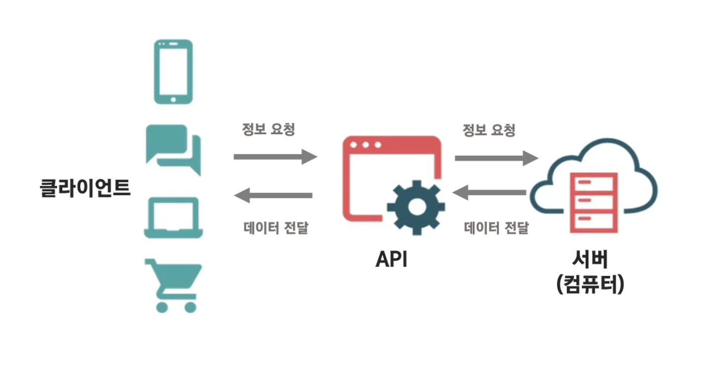
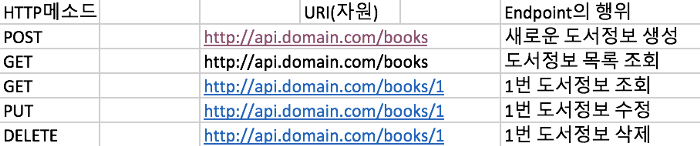
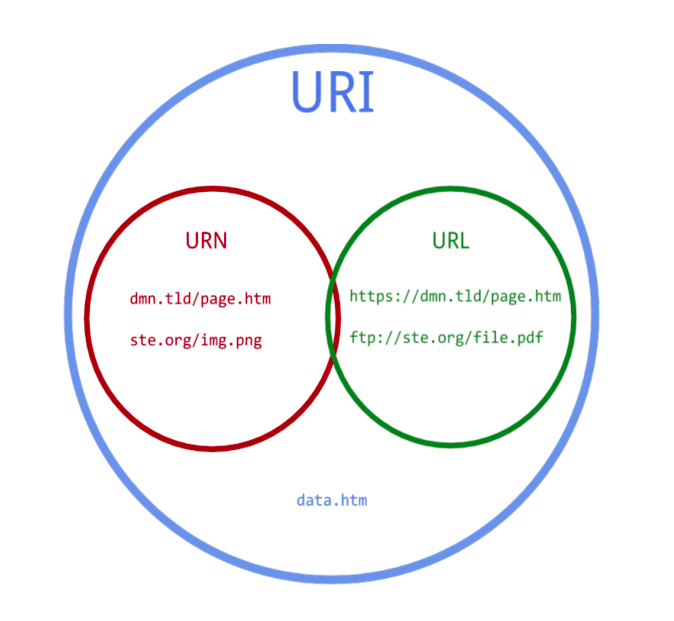
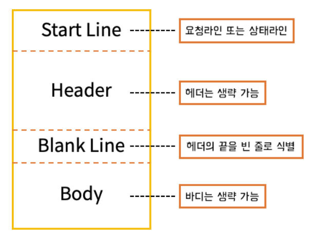
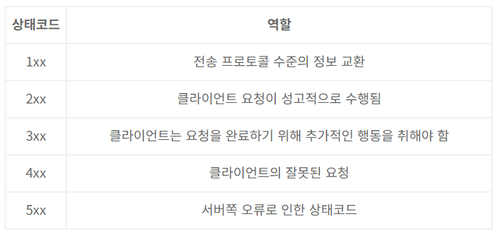

# :cat: API?

**Application Programming Interface**

  서로 다른 소프트웨어 애플리케이션끼리 서로 _소통 / 상호작용_ 을 하기 위한 _규칙 / 프로토콜 / 도구_
  간단히 말해, 서로 다른 프로그램을 이어주는 `연결통로` 인 셈

 

# :cat: REST API?

- REST를 기반으로 만들어진 API

- 웹 통신 규약인 `HTTP` 이용
- 클라이언트와 서버가 소통을 할 때 이용

## :mouse: REST?

**Representaional State Transfer**

URI 사용으로 자원을 이름으로 구분한 뒤, 해당 자원의 상태를 주고 받는 모든 것

1. HTTP URI (Uniform Resoure Identifier) 를 통해 자원 (Resource) 명시

2. HTTP Method를 통해 해당 자원에 대한 CRUD Operation을 적용

## :mouse: REST 구성 요소 / 특징

**구성요소**

- 자원 (Resource)

  - 웹 상에서 식별 가능한 모든 종류의 정보 / 데이터

  - 모든 자원은 고유한 ID (= URI) 존재 => URI를 통해 자원을 구별한다.

- 행위 (Verb)

  - 자원에 대한 (서버의) 행위/동작

  - HTTP Method에 의해 정의

- 표현 (Representations)

  - 클라이언트와 서버 간에 리소스의 상태 정보를 교환하는 데에 사용되는 데이터 형식

  - 서버가 클라이언트에게 적절한 응답을 보내는 것
  - JSON, XML, TEXT, RSS 등 여러 형태로 보낼 수 있음
    > :question: **리소스의 상태 정보**  
    > :arrow_forward: 서버에 저장된 리소스의 데이터 정보

 

**특징**

- Server-Client 구조

  - 자원이 있는 `서버` 와 자원을 요청하는 `클라이언트` 로 구성

  - 서버와 클라이언트를 서로 독립적으로 분리함으로써 의존성 줄임
    _ (각자 독립적으로 발전할 수 있어 시스템의 확장성 향상)_

- Stateless (무상태)

  - 서버와 클라이언트는 서로의 상태를 저장할 필요 없음   즉, 서버는 API를 사용하는 사용자(클라이언트) 에 대해 아무것도 기억하지 않음  _(HTTP가 Stateless라서 HTTP를 활용하는 REST 역시 무상태성)_

  - 서버는 클라이언트의 상태 정보 (사용자의 인증정보/이전활동/선택..) 를 저장하지 않음 => 들어오는 요청을 단순히 처리만 하면 되기 때문에 구현 단순해짐 (리소스 관리만 하니까!)

- Cacheable (캐리 처리 가능)
  - 데이터 복사해 놓은 임시 장소인 캐시 사용 가능   _(HTTP의 캐싱 기능을 REST도 사용할 수 있음)_
- Layered System (계층화)ㅇㅇㅇㅇㅇ
  - 클라이언트와 서버 간의 통신을 여러 계층(프록시 서버, 게이트웨이, 로드 밸런서..) 으로 구성
  - 각 계층은 독립적으로 작업 수행 가능
- Code-On-Demand (주문형 코드, Optional)

  - 클라이언트가 서버에게 코드를 주문하는 것   _(선택사항임 -> 서버가 주기 싫으면 안 줘도 됨)_

  - 클라이언트가 서버에게 코드 요청 -> 서버는 실행 가능한 코드 로직 제공 (JavaScripte와 같은 스크립트 형식의 코드로 제공)

- Uniform Interface (인터페이스 일관성)

  - URI로 지정한 리소스에 대한 조작을 "통일 + 한정적인" 인터페이스로 수행하는 것

  - `GET` `PUT` `POST` `DELETE)` `PATCH` 5가지 인터페이스로 한정지어서 자원에 접근하는 것

## :mouse: REST 장단점

**장점**

- HTTP 프로토콜의 인프라를 그대로 사용 => REST API 사용을 위한 별도의 인프라 구축 필요없음

- HTTP 표준 프로토콜에 따르는 모든 플랫폼에서 사용 가능
- Hypermedia API의 기본을 충실히 지키면서 범용성을 보장
- REST API 메시지로 요청 사항을 명확하게 나타낼 수 있음 => 요청 사항 쉽게 파악 가능
- 서버와 클라이언트의 역확을 명확히 구분 (REST의 특징 중 "Server-Client 구조")
  > :question: Hypermedia API
  >
  > - 데이터의 정보를 동적인 하이퍼링크 정보로 클라이언트에게 전송
  > - 사용자에 의해 데이터의 정보가 바뀌더라도(url 주소 변경...) 클라이언트는 서버로부터 최신의 하이퍼링크 정보를 받기 때문에 잘못된 정보를 받을 수 있는 가능성이 줄어듦

**단점**

- 안티 패턴 설계

  - REST 사상에 어긋나는 패턴인 안티패턴으로 설계될 가능성이 높다. (REST 원칙에 대한 이해 부족, REST API 설계 표준 부재...)
      ex - 1 ) Update/Delete 기능을 POST로 대체하여 사용하는 경우
      ex - 2 ) HTTP Response code를 2, 3개(200, 500 상태코드 정도만) 활용하는 경우

- 표준 규약 부족
  - 구체적인 실행을 위한 REST 아키텍처(구조) 규칙이 없음  => 개발자마다 REST API를 다르게 해석 및 구현을 하기 때문에 구현한 REST API들의 일관성이 떨어지며 상호 운용성이 감소할 수 있음
- HTTP Method 형태 제한적
  - 리소스의 처리 상태를 HTTP 메소드를 통해 표현 => 모든 상태를 HTTP 메소드로 표현하기에는 한계
    ex) "승인", "반려", "보류" 와 같은 복잡한 비즈니스 로직 상태의 표현 한계

## :mouse: 추가 내용

**REST API 설계 규칙**

URI 표현시 `소문자` `마지막 슬래시 X` `하이폰 사용` `파일 확장자 포함 X` `행위 포함 X`

- Bad Example : http://jiyun.com/Test_get_blog.jpg/
- Good Example : http://jiyun.com/test_blog

**RESTful**

REST의 원리를 따르는 시스템 (REST API의 설계 규칙을 올바르게 지킨 시스템 ~ 안티패턴이면 안됨)
REST 아키텍쳐를 구현한 웹 서비스
  `REST API`를 제공하는 웹 서비스 = `RESTful` 하다!

**CRUD Operation**

- 기본적인 데이터 처리 기능
- `Create` `Read` `Update` `Delete`
  - create : 데이터 생성 기능 (POST 요청)
  - Read : 데이터 조회 기능 (GET 요청)
  - Update : 데이터 수정 기능 (PUT, PATCH 요청)
  - Delete : 데이터 삭제 기능 (DELETE 요청)

 

> :heavy_plus_sign: API는 URI를 가지고 통신을 하는 것 (URI에는 리소스/데이터가 담겨있음)

# :cat: API에서 사용하는 용어

**End Point**

- 서버가 요청한 리소스에 접근할 수 있도록 하는 리소스의 위치

- API에서의 엔드포인트 = 서버의 리소스를 제공하는 URI
    _(@GetMapping에 적는 URI)_

 

  위의 그림에서 `/books` `/books/1` 이 **End Point** 이다.

 

**URL & Base URL & URI**

사진을 보면 URI이 가장 큰 개념이고 URI와 URN은 URI 안에 포함되는 하위 개념이다.

- URL

  - Uniform Resource Locator (통합 자원 지시자)

  - 가장 흔히 볼 수 있는 것으로 Resource(자원) 의 정확한 위치 정보(파일의 위치) 를 나차냄
  - URL을 통해 자원에 접근할 수 있다.
  - 만약, 리소스의 위치가 옮겨진다면 해당 URL은 더 이상 사용할 수 없다.

- URN

  - Uniform Resource Name (통합 자원 이름)

  - 자원의 위치와 상관없이 식별 가능한 고유한 이름
  - URL이 변경되더라도 자원 자체의 이름이기 때문에 문제없이 동작 가능 => 이름만으로 리소스 식별 가능

- URI

  - Uniform Resource Identifier (통합 자원 식별자)

  - 자원의 위치 뿐만 아니라 자원에 대한 고유 식별자임 (URL 의미 포함)

> :heavy_plus_sign: URI vs URL
>
> - 주소에 식별자 :o: => URI
> - 주소에 자원의 위치까지만 :o: => URL
>
>   **ex)**   > https://hstory0208.tistory.com/category/12 >   https://hstory0208.tistory.com/category?page=12 >   :arrow_forward: `/12` `?page=12` <- 리소스 식별자가 붙었기 때문에 `URI`
>
>   https://hstory0208.tistory.com/category >   :arrow_forward: `/category` <- 리소스의 실제 위치이므로 `URL`

 

- Base URL
  - 리소스에 접근하기 위해 필요한 공통적인 주소 부분 (루트 주소)
  - 만약 쇼핑몰 API의 Base URL을 https://api.example.com 로 설정했다면, 쇼핑몰 내에서 리소스를 접근할 때 Base URL에 추가 경로가 붙은 채로 URL이 형성된다.
      **ex)** 제품 목록을 조회하는 API의 URL : https://api.example.com/products

 

**HTTP 구조**

HTTP 통신을 할 때 보내는 HTTP Message는 Header 와 Body 로 이뤄져있다.

- Header

  - 요청(by Client) 또는 응답(by Server)시, 전송 데이터에 대한 부가적인 정보를 담는 부분 (날짜, 버전, 보안..)

- Body
  - 요청 또는 응답으로 보내는 진짜 데이터를 담는 부분

 

**HTTP Status Code**

서버는 클라이언트의 요청을 처리한 뒤, 응답 메시지를 클라이언트에게 전송한다.   이때 응답 메시지에 State Code를 담아서 전송하면, 단순히 처리를 성공했는지 실패했는지를 넘어서 실패이유와 같은 명확한 이유 클라이언트에게 전송할 수 있다.  즉, 간결한 숫자 코드만으로 정확한 처리 결과를 클라이언트에게 전달할 수 있다.

 

상태 코드는 세 자리 숫자로 되어 있다.  첫 번째 숫자는 HTTP 응답의 종류를 구분하는 데 사용된다. _(아래의 표 참고)_  나머지 2개의 숫자는 세부적인 응답 내용을 구분하기 위한 번호이다.

 

**HTTP Method**

서버가 수행해야 할 동작을 클라이언트가 HTTP Method를 요청 데이터와 함께 전송

- **GET** : 리소스(요청 데이터) 조회

- **POST** : 리소스 등록/생성
- **PUT** : 리소스 전체 변경
- **PATCH** : 리소스 부분 변경
- **DELETE** : 리소스 삭제
- **HEAD** : GET과 동일하지만 body 부분(= 메시지 부분) 을 제외 (서버는 상태 줄과 헤더만 반환해야 함)
- **OPTIONS** : 대상 리소스에 대한 통신 옵션 (CORS에서 사용)
- **TRACE** : 리소스를 응답 body에 그대로 넣고 클라이언트에게 보냄
